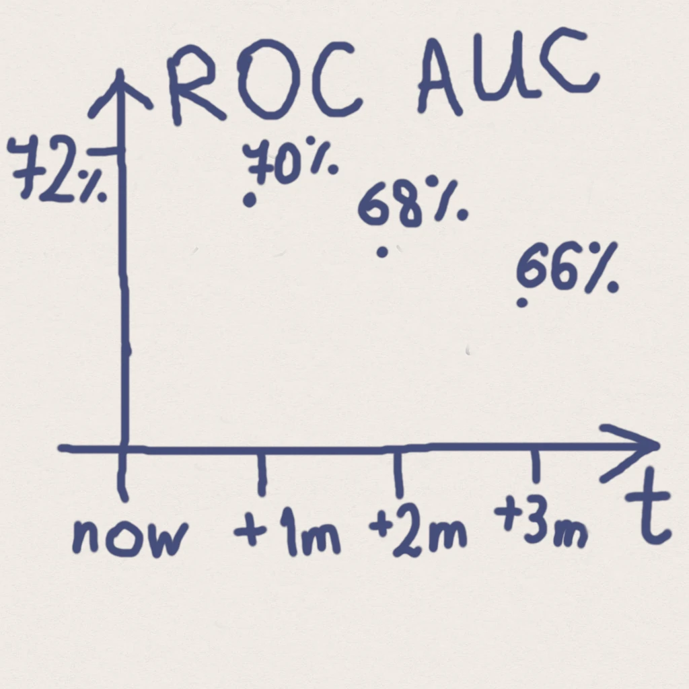
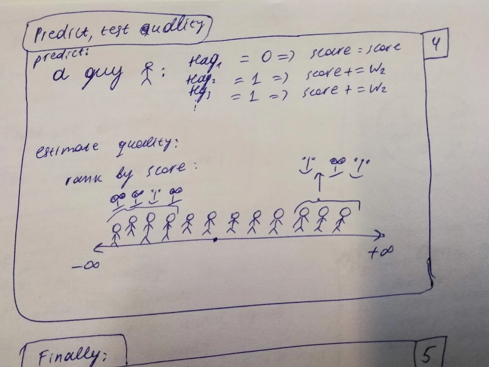
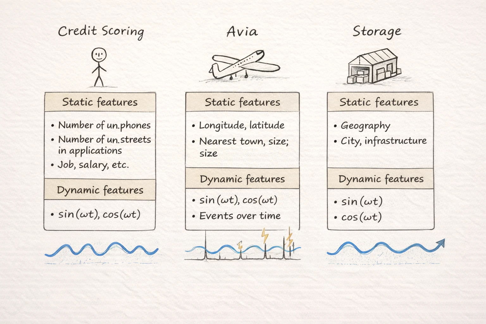
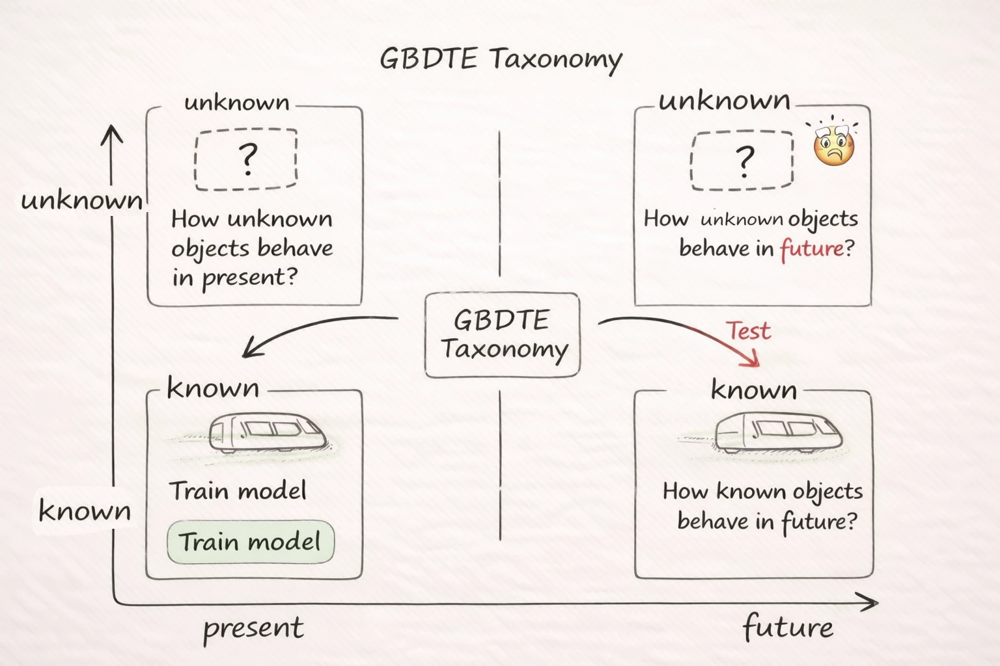

# Title author

* GBDTE with examples
* A.S. Trushin, Yandex Delivery

# Plan

* The main claim
* Rationale: The Credit Scoring Task
* GBDTE: algorithm, running time
* MSE and LogLoss datasets

# The main claim

* I present an open source package GBDTE
* GBDTE can handle millions of records with dozens of factors
* clean factors roles: interpolation v.s. extrapolation
* Loss functions: MSE, Logloss, Poisson
* synthetic datasets for MSE and Logloss modes

<!--->
* Rationale: The Credit Scoring Task
<!--->

# The Credit Scoring Task

* Dataset
  * current credit loan application -> list of previous
  * features
    * number of unique phone numbers in previous applications
    * number of unique streets in previous applications
    * jobs
    * etc.
  * target - problems with payments, > 3 months delay

# Quality deterioration
  * we already 3 month late
  * 72% ROC AUC immediately
  * 70, 68, 66% - +1, +2, +3 months

# Source of problem
  * the dataset drifts
  * groups of people change their value
  * n_unique_phones == 3: +50% (2014), +0% (2015), -50% (2016)
  * most of ML models are interpolators

# Solution
  * Gradient Boosted Decision Trees with Extrapolations
  * Vanilla: split features + target
  * Extra: split features + extra features + target

<!--->
GBDTE: algorithm, running time
<!--->

# Vanilla GBDT (loss, L(w))
  * dataset - one prediction
  * loss over dataset as function of prediction
  * tailor approximation
  * x0 = -b / (2a) - second order method, one step toward root

# Vanilla GBDT (split)
  * split over variable
  * optimization over matrix (samples x features)
  * scan through columns, then through sorted values
  * parallelize over features

# Resulting model
  * splits - groups of objects
  * weights - opinion on how good/bad they are
  * connection with ROC: by giving additive score, push to the front/back positions, improve overall curve and total score

# Extra GBDT (base)
  * two types of features: static for grouping objects, dynamic for catching trends
  * examples: credit scoring, avia market, storages

# Extra GBDT (testing)
  * extra gbdt testing: known/unknown, present/future

# Compare with previous approaches
  * including split features into weights breaks the idea of grouping and catching trends in groups
  * failure of previous attempts of using this technique
  * LinXGBoost (2017) - 1 thread, Python + numpy, 
  * LightGBM: the closest match (MSE, Logloss, Poisson); no extra/interpolation division
  * GBDT-PL: Logloss - ?, No Poisson, no e/i division
  * PINEBoost: features not clear from the poster

# Algorithm
  * mse and logloss => loss function, derivative, second derivative

# Vanilla Running Time
  * each step: n * log n - sort for each feature column
  * linear pass over column and target
  * T = $O (m \cdot n \cdot log(n))$
  * parallel computation over features

# GBDTE Running Time
  * the same schema, calculate cumulative first and second derivative matrices
  * multiplier: reverse matrix calculation
  * T = $O (m \cdot n \cdot log(n) + m\cdot n \cdot k^3)$

# TensorFlow implementation
  * proof of concept
  * python + tensorflow for vectorized matrices operations

# Golang implementation
  * 2000 LOC
  * golang - python bridge: Thanks God for vibecoding
  * multithread implementation

<!--->
MSE and LogLoss datasets
<!--->

# Datasets (production)
  * Credit Scoring - proprietary
  * Frequency of applications - proprietary
  * Airflights - broken by Covid

# Vicious circle
  * no technology - no datasets
  * no datasets - no technology

# Break vicious circle
  * synthetic datasets
  * MSE
  * Logloss

# MSE
  * "GRADIENT BOOSTING" as scatterplot
  * greedy algorithm for components extraction [1, t, cos(50t), sin(50t)]
  * small:
    * ~100 points, 8 groups, 3 static features, 4 dynamic features
  * big:
    * 10000 points, 128 groups, 7 static features, 4 dynamic features

# Logloss (idea)
  * static features: binary; target: binary
  * dynamic features: 2, [1, t]
  * key idea - to introduce time dependence into statistical properties
  * time: 0 - 1
  * train: 0-0.4, test: 0.4 - 1.0

# Logloss (implementation of generator)
  * parameters: 
    * alpha: <l> - average value of target
    * beta: parameters coverage
    * gamma: lift
  * variables for the dataset: a, b, c, d - mutual probabilities - 4
  * equations: a + b + c + d = 1, alpha, beta, gamma - 4

# Logloss (implementation of generator)
  * up and down lift:
    * lift_up = 0.5 + t
    * lift_down = 1.5 - t
  * rigorous analysis: optimal score should be a linear function as well

# Experiments with the model (MSE, big dataset)
  * stumps (h = 1)
    * points are in the middle of letters, lack of discerning power
    * losses are big on train and on test
  * full grown trees (h = 7)
    * letters are covered
    * small value of train and test MSE loss

# Experiments with the model (MSE, small dataset, one tree)
  * plot with tree and linear models in the leaves
  * plot with three curves
  * talk about ways in trees and components

# Experiments with the model (Logloss)
  * 16 variables, lr = 1 => logloss falls almost linearly in 16 steps of model's training
  * stumps (h = 1) are great, the same structure as Bayesian-optimal model

# Inadvertently set experiment
  * static factors were mixed into extra variables
  * quality of prediction was lower than expected

# Recup
  * Motivation: drift of dataset, credit scoring
  * Vanilla GBDT, Extra GBDT
  * synthetic datasets: MSE, Logloss

# Takeouts
  * there is an open repository with effecient GBDTE implementation
  * there are synthetic MSE and Logloss datasets to play with
  * if you have a real dataset with objects to group and trends to extract, tell me, please
