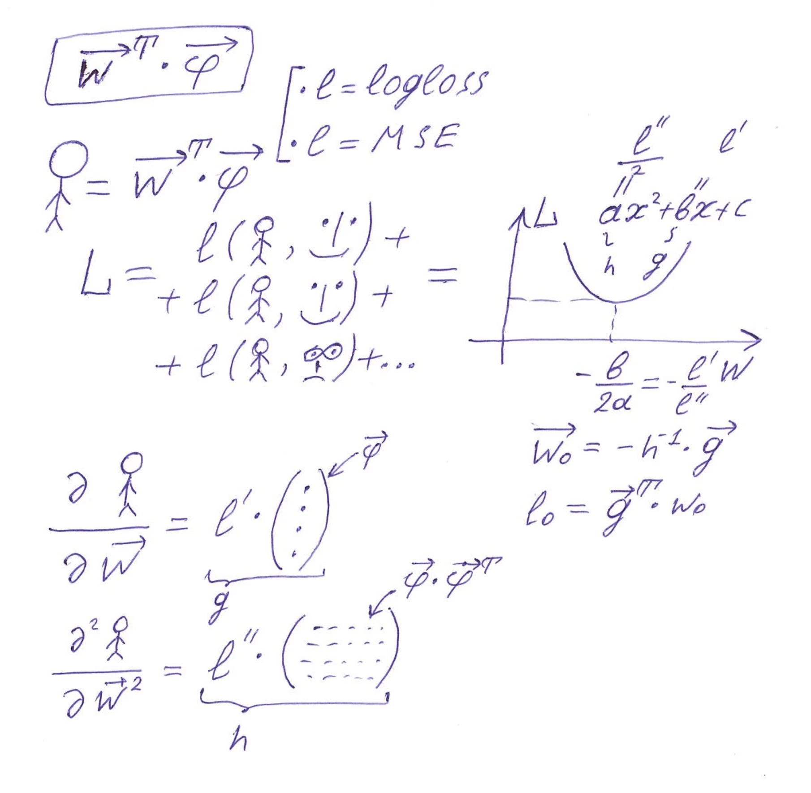

I want to have a small presentation with two slides. There is a title with bullet points for each slide. Use latex-like formatting for math expressions. Create slide that supports the speaker's talk in the best way.

# Vanilla GBDT (loss, L(w))
  * dataset - one prediction
  * loss over dataset as function of prediction
  * tailor approximation
  * x0 = -b / (2a) - second order method, one step toward root
## speaker's text
This man figure represents a score which the model gives to one datasets object. In vanilla algorithm it's a weight, in extended - a vector. Score is a dot product of weights in a leaf of decision tree on extra features. L is the distance between our predictions and real target. We can use MSE, LogLoss or Poisson loss. When we want to find optimal weight vector for a piece of a dataset, we use Tailor series approximation and calculate derivatives of loss over the current leaf value. In vanilla derivatives are scalar, in extra - vector and matrix. Expressions for the optimum are surprizingly simple and still are of school-level.

# Vanilla GBDT (split)
  * split over variable
  * optimization over matrix (samples x features)
  * scan through columns, then through sorted values
  * parallelize over features

## speaker's text
Optimal computational schema for extrapolating gradient boosted trees in general repeats steps in vanilla algorithm: we are to sort each column in our interpolation features part of the dataset. It takes T=O(m * n * log(n)) time in terms of n - number of records in the dataset, m - number of interpolating features. For each column we are to calculate running sums of derivatives, it takes T=O(m * n * k * k) time. And last, but not least, matrices inversion: T = O(n * m * k * k * k). From mathematical point of view one can consider tricks from matrix algebra or histogram calculation. But from the practical point of view, these complexities plus CPU multithreading is enough to make this package of practical interest and unlock a new field for experiments. 
