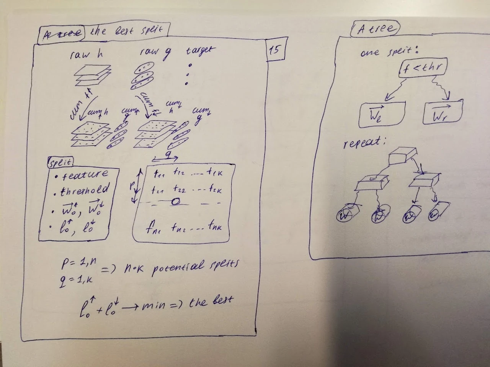

## speaker's text

Optimal computational schema for extrapolating gradient boosted trees in general repeats steps in vanilla algorithm: we are to sort each column in our interpolation features part of the dataset. It takes T=O(m * n * log(n)) time in terms of n - number of records in the dataset, m - number of interpolating features. For each column we are to calculate running sums of derivatives, it takes T=O(m * n * k * k) time. And last, but not least, matrices inversion: T = O(n * m * k * k * k). From mathematical point of view one can consider tricks from matrix algebra or histogram calculation. But from the practical point of view, these complexities plus CPU multithreading is enough to make this package of practical interest and unlock a new field for experiments. 